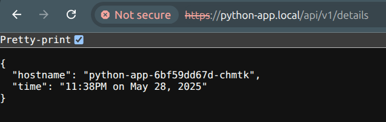

# Python App

A simple application to deploy on K8s

```bash
# Create a virtual environment and activate it
python -m venv .venv
. .venv/bin/activate

# Install dependencies
pip install -r requirements.txt

# Run the application
python app.py
```

## Kubernetes Deployment

To save some money ;), I'm using Kind to deploy this application.

Referente [here](https://kind.sigs.k8s.io/docs/user/ingress/). Delete any Kind cluster before running the following command:

```bash
cat <<EOF | kind create cluster --config=-
kind: Cluster
apiVersion: kind.x-k8s.io/v1alpha4
nodes:
- role: control-plane
  extraPortMappings:
  - containerPort: 80
    hostPort: 80
    protocol: TCP
  - containerPort: 443
    hostPort: 443
    protocol: TCP
EOF
```

Then install the Ingress NGINX controller:

```bash
kubectl apply -f https://kind.sigs.k8s.io/examples/ingress/deploy-ingress-nginx.yaml
```

Finally, deploy the application:

```bash
cd k8s
kubectl apply -f .
kubectl get pods
```


## Helm Chart

Creating a Helm chart for this application is straightforward. The chart is located in the `charts` directory.

To install the chart, run the following command:

```bash
cd charts/python-app
helm install python-app -n python --create-namespace .
```

